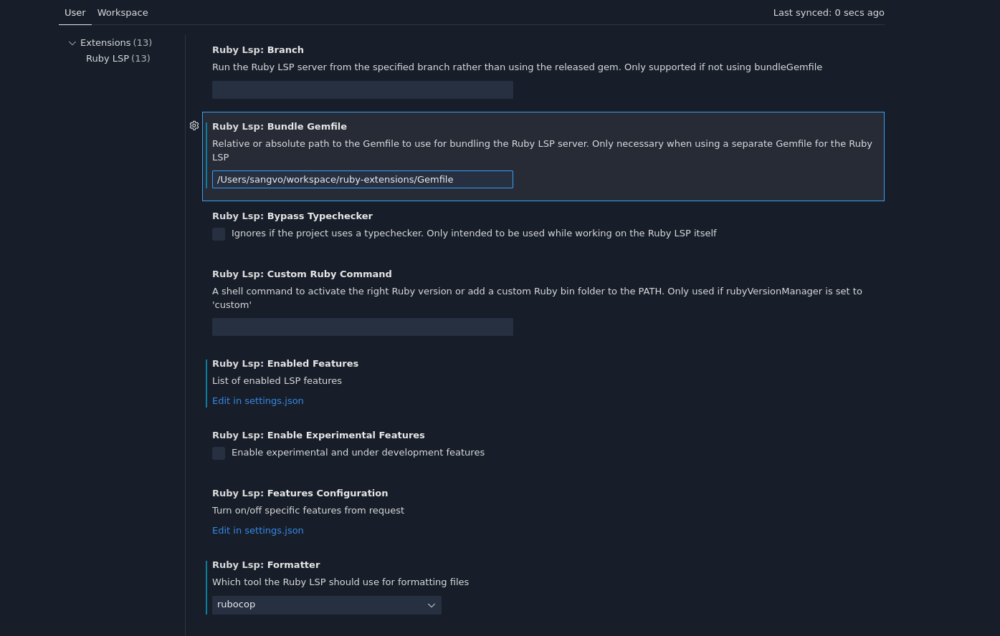

## How to use
1. clone this repo
2. `cd ruby-extensions`
3. `bundle install`
4. Open terminal and run `pwd` to get the path
5. Open Vscode install Ruby LSP extension
6. Setting path
```sh
/Users/sangvo/workspace/ruby-extensions/Gemfile
```


Happy coding!
